# Inkpostor E2E Test Flow Diagrams

This document provides visual Mermaid flow diagrams for all 35 End-to-End (E2E) spec files in the Inkpostor test suite. Each diagram maps the multi-client state machine, phase transitions, and assertions executed by Playwright.

---

## Index of E2E Flow Diagrams

1. [Game Loops & Modes](#1-game-loops--modes)
   - `full-game-classic.spec.ts`
   - `full-game-chaos.spec.ts`
   - `multi-round-hotword.spec.ts`
   - `original-mode.spec.ts`
   - `original-chaos-mode.spec.ts`
   - `original-turn-order.spec.ts`
   - `original-virtual-voting.spec.ts`
2. [Multi-Impostor Suites](#2-multi-impostor-suites)
   - `multi-impostor.spec.ts`
   - `multi-impostor-hotword.spec.ts`
   - `multi-impostor-customword.spec.ts`
   - `multi-impostor-original.spec.ts`
3. [Impostor Secret Word Guesses](#3-impostor-secret-word-guesses)
   - `impostor-guess-game.spec.ts`
   - `impostor-inphase-guess.spec.ts`
   - `impostor-lethal-pool.spec.ts`
   - `cross-language-guess.spec.ts`
4. [Canvas & Real-Time Sync](#4-canvas--real-time-sync)
   - `canvas-drawing-sync.spec.ts`
   - `canvas-undo-sync.spec.ts`
   - `suspects-marker.spec.ts`
   - `canvas-features.spec.ts`
5. [Network Resilience & Edge Cases](#5-network-resilience--edge-cases)
   - `reconnection.spec.ts`
   - `host-drop-recovery.spec.ts`
   - `host-actions.spec.ts`
   - `backend-docs-edge-cases.spec.ts`
6. [Room Configuration & UI Guards](#6-room-configuration--ui-guards)
   - `multiplayer.spec.ts`
   - `options-modal.spec.ts`
   - `impostor-count-shrinks.spec.ts`
   - `game-mode-staging.spec.ts`
   - `non-host-permissions.spec.ts`
   - `room-capacity-limit.spec.ts`
   - `timer-expirations.spec.ts`
   - `validations-errors.spec.ts`
   - `i18n-language.spec.ts`
   - `sound-options.spec.ts`
7. [Match Simulations](#7-match-simulations)
   - `real-gameplay-matches.spec.ts`
   - `extended-real-gameplay.spec.ts`
   - `more-real-gameplay-matches.spec.ts`

---

## 1. Game Loops & Modes

### `full-game-classic.spec.ts` — Full CLASSIC Game Loop

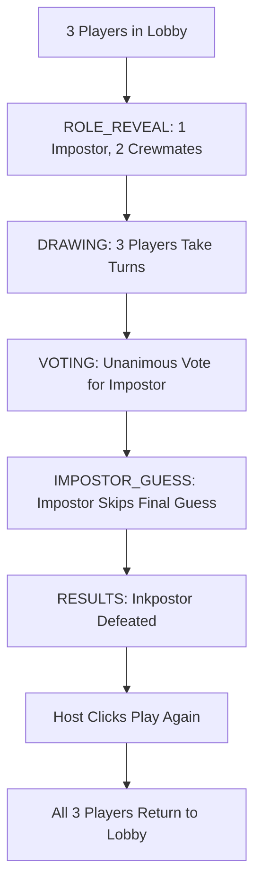

### `full-game-chaos.spec.ts` — Full CUSTOM_WORD Chaos Journey

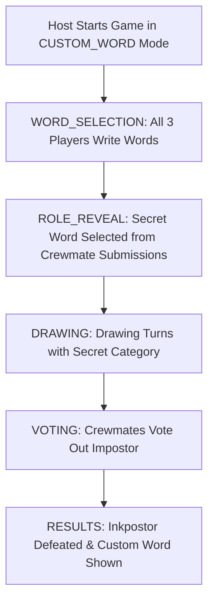

### `multi-round-hotword.spec.ts` — Multi-Round HOT_WORD Rotation

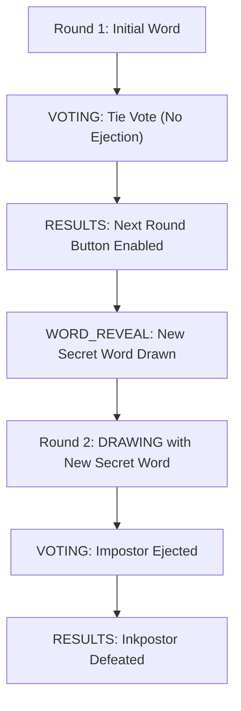

### `original-mode.spec.ts` — ORIGINAL Spoken Mode (No Canvas)

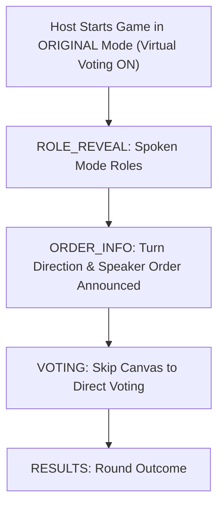

### `original-chaos-mode.spec.ts` — ORIGINAL_CHAOS Player-Written Word Spoken Journey

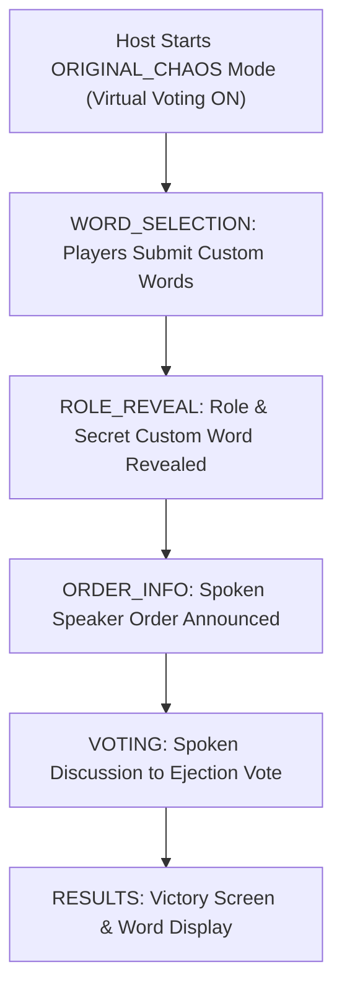

### `original-virtual-voting.spec.ts` — Spoken Modes Without The Virtual Voting (Default)

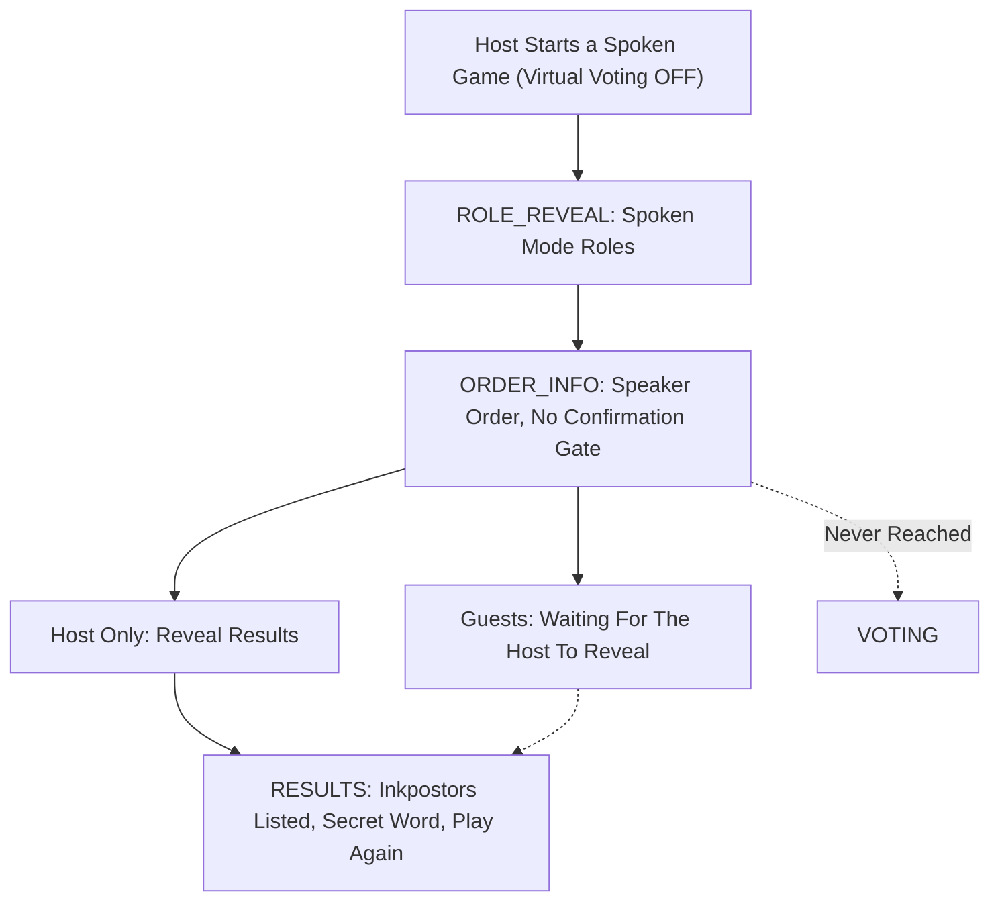

### `original-turn-order.spec.ts` — ORIGINAL Mode FIXED_ORDER vs RANDOM_ORDER

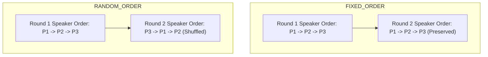

---

## 2. Multi-Impostor Suites

### `multi-impostor.spec.ts` — 5-Player CLASSIC Multi-Impostor Game

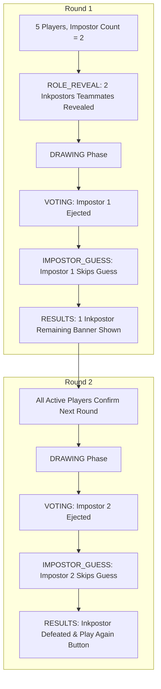

### `multi-impostor-hotword.spec.ts` — Multi-Impostor HOT_WORD Journey

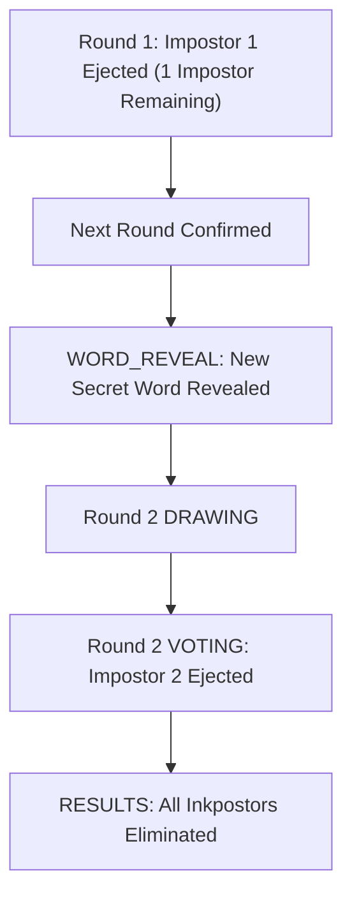

### `multi-impostor-customword.spec.ts` — Multi-Impostor CUSTOM_WORD Chaos Journey

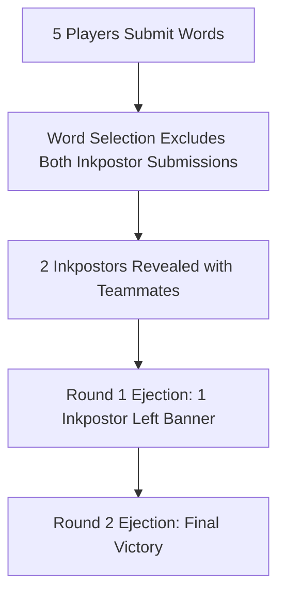

### `multi-impostor-original.spec.ts` — Multi-Impostor ORIGINAL Spoken Journey

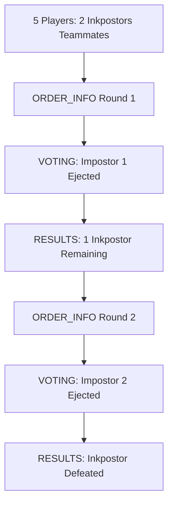

---

## 3. Impostor Secret Word Guesses

### `impostor-guess-game.spec.ts` — Impostor Final Guess Feature Flow

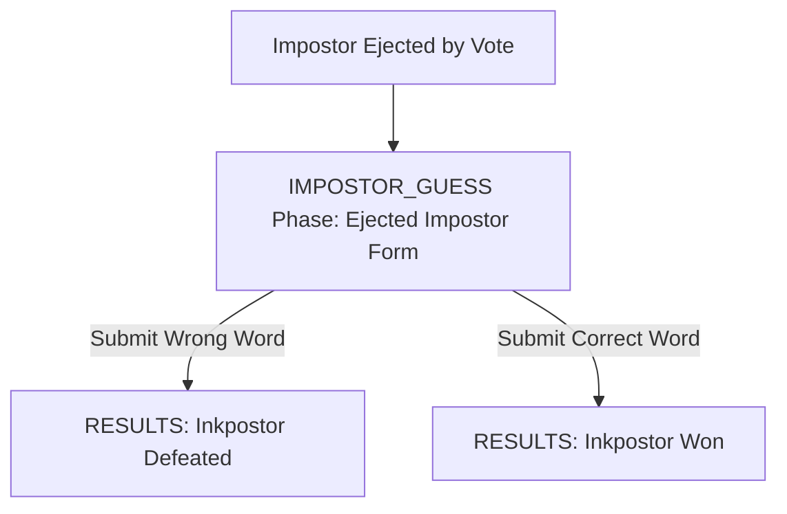

### `impostor-inphase-guess.spec.ts` — In-Phase Impostor Secret Word Guess

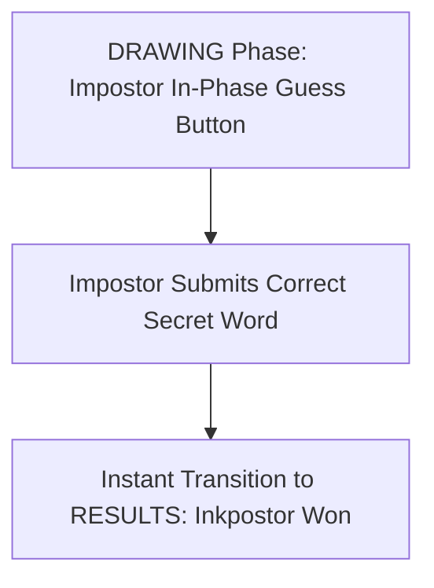

### `impostor-lethal-pool.spec.ts` — Impostor Loses On Lethal Guess Pool Depletion

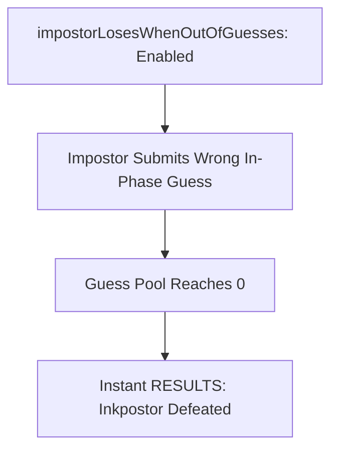

### `cross-language-guess.spec.ts` — Localized Secret Word Validation

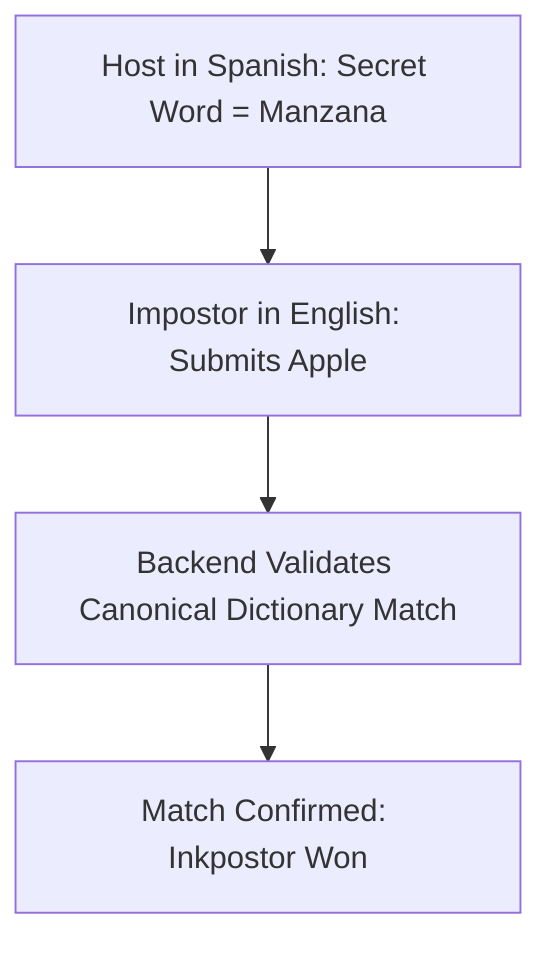

---

## 4. Canvas & Real-Time Sync

### `canvas-drawing-sync.spec.ts` — Real-Time Mouse Stroke Broadcasting

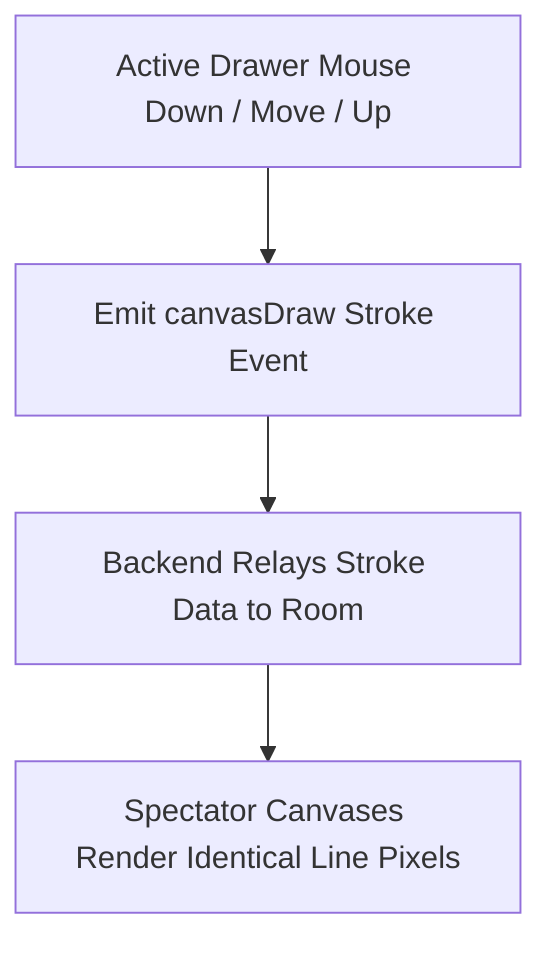

### `canvas-undo-sync.spec.ts` — Canvas Undo Stack Sync

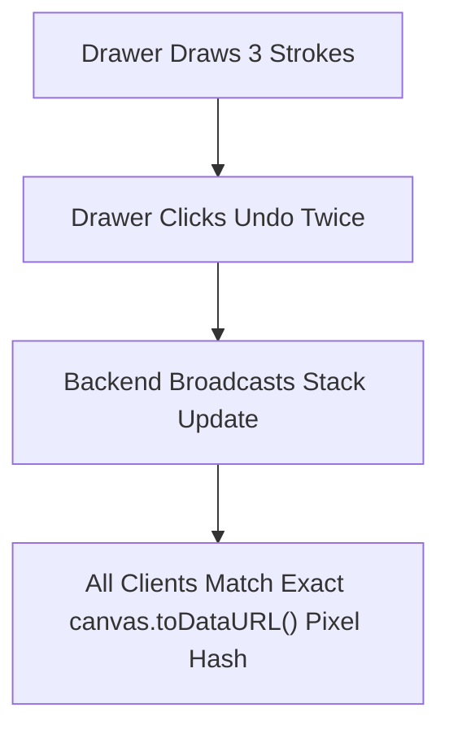

### `suspects-marker.spec.ts` — Suspect Marker Persistence

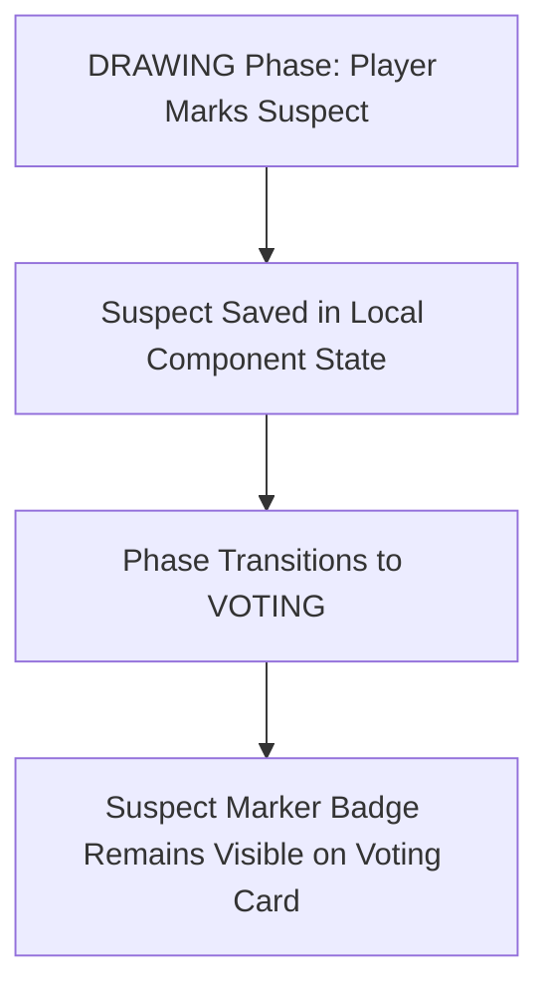

### `canvas-features.spec.ts` — Emergency Alert & Vote-Kick Flow

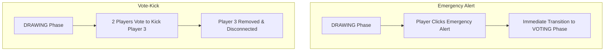

---

## 5. Network Resilience & Edge Cases

### `reconnection.spec.ts` — Network Disconnect & Reconnect Recovery

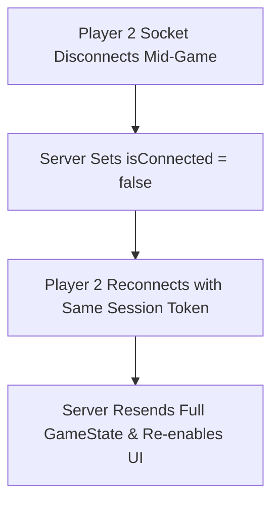

### `host-drop-recovery.spec.ts` — Mid-Turn Host Tab Closure

```mermaid
flowchart TD
    HostActive["Host Drawing Turn"] --> HostClose["Host Closes Tab / Drops Socket"]
    HostClose --> TurnReeval["Server Re-evaluates Active Turn Order"]
    TurnReeval --> NextPlayerTurn["Turn Advances to Player 2 Without App Stutter"]
```

### `host-actions.spec.ts` — Host End Game & Room Termination

```mermaid
flowchart TD
    MidGame["Game in Progress"] --> HostEndGame["Host Clicks End Game"]
    HostEndGame --> GameTerminated["room.gameEnded = true, all players returned to RESULTS"]
```

### `backend-docs-edge-cases.spec.ts` — Backend Specification Parity & Disconnect Edge Cases

```mermaid
flowchart TD
    subgraph LobbyKick["Lobby Kick"]
        HostKick["Host Kicks Player from Lobby"] --> TargetRedirect["Target Redirected to Join Screen"]
    end
    subgraph LastVoterDisconnect["Last Voter Disconnect"]
        LastVoter["Last Pending Voter Drops Socket"] --> AutoResolve["Voting Resolves Immediately"]
    end
```

---

## 6. Room Configuration & UI Guards

### `multiplayer.spec.ts` — Room Creation & Joining

```mermaid
flowchart TD
    HostCreate["Host Creates Room"] --> RoomCode["Server Returns 6-Char Code"]
    RoomCode --> Player2Join["Player 2 Joins Room Code"]
    Player2Join --> SyncLobby["Both Players Visible in Lobby Roster"]
```

### `options-modal.spec.ts` — Game Options Modal & Mode Lock Rules

```mermaid
flowchart TD
    OpenModal["Host Opens Options Modal"] --> Modify["Adjust Round Time, Impostor Count, Guess Toggles, Prevent Repeat"]
    Modify --> SelectMode["Select Spoken / Custom Word Mode"]
    SelectMode --> LockRules["Mode Locks Mask Disabled Options with Padlock/Hidden Rules"]
    LockRules --> Save["Save Options -> Server Applies hostGameOptions & gameOptions"]
```

### `prevent-repeat-impostors.spec.ts` — Prevent Repeat Inkpostors Option

```mermaid
flowchart TD
    HostCreate["Host Creates Room"] --> OpenOpt["Host Opens Options Modal"]
    OpenOpt --> CheckToggle["Verify Prevent Repeat Inkpostors Toggle is ON by default"]
    CheckToggle --> ToggleOff["Host Toggles Option OFF & Saves"]
    ToggleOff --> ReopenOpt["Host Re-opens Modal -> Verify OFF state persisted"]
```

### `impostor-count-shrinks.spec.ts` — Inkpostor Count Follows The Room

```mermaid
flowchart TD
    FivePlayers["5 Players in Lobby"] --> SetTwo["Host Sets 2 Inkpostors & Saves"]
    SetTwo --> GuestReads["Guest Opens Options -> Reads 2"]
    GuestReads --> Leaves["One Player Leaves -> 4 Remain"]
    Leaves --> HostCorrects["Host Client Saves the Count 4 Players Allow"]
    HostCorrects --> BackToOne["Host & Guest Both Read 1, Steppers Disabled"]
```

### `game-mode-staging.spec.ts` — Staged Options vs Lock Restoration

```mermaid
flowchart TD
    StageMode["Stage ORIGINAL Mode (Hides Drawing Options)"] --> Cancel["Cancel / Switch Back to CLASSIC"]
    Cancel --> Restored["Drawing Options Restored with Preserved Values"]
```

### `non-host-permissions.spec.ts` — Non-Host UI Permission Guards

```mermaid
flowchart TD
    NonHostView["Non-Host Joins Lobby"] --> Verification["Verify Start Game Button Omitted & Options Modal Read-Only"]
```

### `room-capacity-limit.spec.ts` — 10-Player Capacity Limit Guard

```mermaid
flowchart TD
    Cap10["10 Players Fill Lobby"] --> Player11Join["11th Player Attempts Join"]
    Player11Join --> ErrorToast["Server Rejects with ROOM_FULL Error"]
```

### `timer-expirations.spec.ts` — Turn & Voting Timer Expirations

```mermaid
flowchart TD
    TurnTimeout["Turn Timer Reaches 0"] --> AutoNextTurn["Server Advances Turn Index"]
    VoteTimeout["Voting Timer Reaches 0"] --> AutoSkip["Server Auto-Skips Unsubmitted Votes & Resolves Phase"]
```

### `validations-errors.spec.ts` — Input Validation & Minimal Player Guards

```mermaid
flowchart TD
    BadCode["Enter Invalid Room Code"] --> CodeError["Show 'Room not found' Error"]
    LowPlayers["Lobby with 2 Players"] --> DisabledStart["Start Game Button Disabled"]
```

### `i18n-language.spec.ts` — Dynamic Language Switching

```mermaid
flowchart TD
    ToggleLang["User Toggles Language Selector (EN -> ES -> CA)"] --> Dynamici18n["UI Text Updates Instantly Across All Screens"]
```

### `sound-options.spec.ts` — Sound Effects & Volume Option Controls

```mermaid
flowchart TD
    subgraph Topbar & Quick Toggle
        HostStart["Host Creates Room"] --> TopbarAudio["Topbar Speaker Button (Mute/Unmute)"]
        TopbarAudio --> QuickMute["Click Mutes Audio & Persists in LocalStorage"]
    end

    subgraph Options Modal Sound Controls
        OpenOptions["Open Options Modal"] --> SoundSec["Sound & Volume Section Rendered"]
        SoundSec --> Slider["Adjust Volume Slider (0% - 100%)"]
        SoundSec --> TestBtn["Click 'Test Sound' Audio Preview"]
        SoundSec --> ModalMute["Toggle Mute Switch in Modal"]
        ModalMute --> DisableSlider["Volume Slider & Test Button Disabled"]
    end

    subgraph Multi-Player & Reload Persistence
        PageReload["Reload Page"] --> RestoreSettings["Restores Volume & Mute State from LocalStorage"]
        GuestJoin["Player 2 (Guest) Joins Room"] --> GuestOptions["Guest Opens Options Modal"]
        GuestOptions --> GuestIndependentAudio["Guest Configures Personal Volume & Audio Independently"]
    end

    QuickMute --> OpenOptions
    DisableSlider --> PageReload
    RestoreSettings --> GuestJoin
```

---

## 7. Match Simulations

### `real-gameplay-matches.spec.ts` — Matches 1–5 Real Gameplay Scenarios

```mermaid
flowchart TD
    Match1["Match 1: Unanimous Voting Win"]
    Match2["Match 2: Impostor Victory by Framing Innocent Crewmate"]
    Match3["Match 3: In-Phase Secret Word Clutch"]
    Match4["Match 4: Emergency Alert Vote-Kick"]
    Match5["Match 5: Canvas Line Drawing Sync Verification"]
```

### `extended-real-gameplay.spec.ts` — Matches 6–10 Real Gameplay Scenarios

```mermaid
flowchart TD
    Match6["Match 6: Multi-Round Tie Resolution"]
    Match7["Match 7: 4-Player 3/3 Vote-Kick Threshold"]
    Match8["Match 8: Limited Ink Depletion Mechanics"]
    Match9["Match 9: Rapid 3-Round Game Loop"]
    Match10["Match 10: Disconnect Recovery Mid-Turn"]
```

### `more-real-gameplay-matches.spec.ts` — Matches 11–15 Real Gameplay Scenarios

```mermaid
flowchart TD
    Match11["Match 11: 5-Player Split Vote Tie"]
    Match12["Match 12: Emergency Alert Disconnect Recovery"]
    Match13["Match 13: Color Palette & Eraser Sync"]
    Match14["Match 14: Custom Word Selection Filtering"]
    Match15["Match 15: Lethal Guess Pool Depletion Victory"]
```
