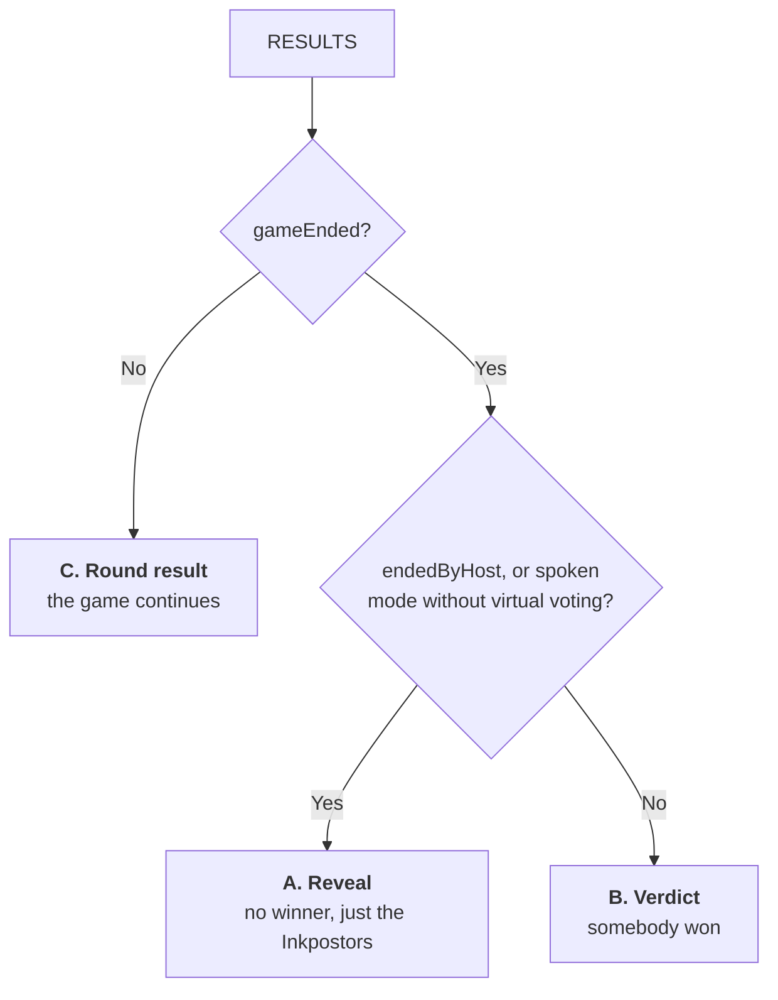

# The Results Screen (`RESULTS`)

Every game reaches the same screen, but it is really **three layouts in one**,
and each of them has its own set of texts. This document lists every case the
screen can be in, what puts it there, and exactly which strings it can print.

Source: [`src/components/GameResult.tsx`](../src/components/GameResult.tsx) and
the pieces in [`src/components/result`](../src/components/result) — §8 maps each
case below to the file that draws it — plus the `result.*` keys in
[`src/i18n/locales`](../src/i18n/locales) (`en`, `es`, `ca` — the English text is
quoted throughout this file).

---

## 1. What the screen reads

The screen never guesses: everything below comes from the room state the server
broadcasts. `RESULTS` is reached both **between rounds** and at the **end of the
game**, so the first question is always `gameEnded`.

| State | Meaning on this screen |
|---|---|
| `gameEnded` | The game is over. Otherwise this is a round result and the game continues. |
| `endedByHost` | The game was closed instead of played out: the host pressed End Game, or revealed a spoken round. Nobody won. |
| `gameMode` + `gameOptions.virtualVotingEnabled` | A spoken mode with the voting off never plays `VOTING`, so its ending is a reveal too (fallback for a server that doesn't report `endedByHost`). |
| `ejectedId` | Who the vote (or a kick) put out. Resolved against the player list — see §5. |
| `impostorIds` | The impostors. Hidden by the server until the game is over, so this is empty on a round result. |
| `ejectedWasImpostor`, `remainingImpostorCount` | Computed by the server for round results, where the impostors are still secret. |
| `impostorGuessedCorrectly`, `impostorOutOfGuesses` | How a guess ended the game. Neither can be inferred by the client. |
| `guessingImpostorId` | Which impostor made that guess, so the line about it names them rather than the whole team. |
| `kickedOutPlayers` | Everyone a vote-kick removed from the room. They are gone from `players`, but the reveal may still have to name them. |
| `secretWord` | Revealed with the game. `null` when the game ended before a word existed. |

Two derived values drive the layout:

```
isRevealOnly       = endedByHost || (isSpokenMode(gameMode) && !virtualVotingEnabled)
allImpostorsDefeated = (no active impostors || impostorOutOfGuesses) && !impostorGuessedCorrectly
```

---

## 2. Which layout is shown



| | A. Reveal | B. Verdict | C. Round result |
|---|---|---|---|
| Title | `impostorsTitle` | `impostorDefeated` / `impostorWon` | `voteResult` |
| Panel | Neutral (`ink-surface`) | Green when the crewmates win, red when the Inkpostors do | Neutral |
| Centre | Inkpostor cards | Ejected card, or Inkpostor cards when there is nobody to eject | Ejected card, or a question mark |
| Secret word | Yes | Yes | No |
| Footer | Play Again (host) / `waitingRestart` | Same | Next Round / waiting counter |

---

## 3. Every case, end to end

### A. Reveal — nobody won (`endedByHost`)

| # | How the game got here | Title | Centre | Texts |
|---|---|---|---|---|
| A1 | Host revealed a spoken round (virtual voting off) | `impostorsTitle` | One card per Inkpostor | `wereImpostors` / `wasImpostor` |
| A2 | Host pressed **End Game** mid-game, any mode | `impostorsTitle` | One card per Inkpostor | `wereImpostors` / `wasImpostor` |
| A3 | Same, but the game never got a word (`WORD_SELECTION`) | `impostorsTitle` | One card per Inkpostor | `wereImpostors` / `wasImpostor`, plus `noSecretWord` |

> The plural is decided by how many impostors the room dealt, so a one-impostor
> game reads "The Inkpostor" and `wasImpostor`.

### B. Verdict — the game was played out

| # | How the game ended | Title | Centre | Texts |
|---|---|---|---|---|
| B1 | The vote ejected the **last** Inkpostor | `impostorDefeated` | Ejected card | `ejectedAndWasImpostor` (or `ejectedAndWereImpostors` with several) |
| B2 | The vote ejected a crewmate and the Inkpostors reached parity | `impostorWon` | Ejected card | `ejectedCrewmateWasImpostor` (or `ejectedCrewmateWereImpostors`) |
| B3 | The ejected Inkpostor failed or skipped their final guess | `impostorDefeated` | Ejected card | `ejectedAndWasImpostor` / `ejectedAndWereImpostors` |
| B4 | The ejected Inkpostor **guessed the word** in `IMPOSTOR_GUESS` | `impostorWon` | Ejected card | the ejection line **+** `impostorGuessedWord` |
| B5 | An Inkpostor guessed the word during `DRAWING` / `VOTING` (no ejection) | `impostorWon` | Inkpostor cards | `wasImpostor` / `wereImpostors` **+** `impostorGuessedWord` |
| B6 | An Inkpostor spent a lethal guess pool (no ejection) | `impostorDefeated` | Inkpostor cards | `wasImpostor` / `wereImpostors` **+** `impostorFailedGuesses` |
| B7 | A vote-kick removed the Inkpostor and ended the game | `impostorDefeated` | Ejected card (named from `kickedOutPlayers`) | `ejectedAndWasImpostor` / `ejectedAndWereImpostors` |
| B8 | A vote-kick left fewer than 3 players, Inkpostor still playing | `impostorWon` | Ejected card | `ejectedCrewmateWasImpostor` / `ejectedCrewmateWereImpostors` |
| B9 | Same, but the Inkpostor was already gone (abandoned) | `impostorDefeated` | Ejected card | `ejectedAndWasImpostor` / `ejectedAndWereImpostors` |

### C. Round result — the game continues

| # | What the round did | Title | Centre | Texts |
|---|---|---|---|---|
| C1 | An Inkpostor was ejected and others remain | `voteResult` | Ejected card | `wasEjected` **+** `impostorEjectedMoreLeft` (singular/plural by the server's count) |
| C2 | A crewmate was ejected | `voteResult` | Ejected card | `wasEjected` **+** `stillAmongUs` |
| C3 | The vote tied, or everyone skipped | `voteResult` | Question mark | `nobodyEjected` |

---

## 4. The complete text catalogue

**Titles**

| Key | English | When |
|---|---|---|
| `impostorsTitle_one` / `_other` | "The Inkpostor" / "The Inkpostors" | Layout A |
| `impostorDefeated` | "Inkpostor Defeated" | Layout B, crewmates win |
| `impostorWon` | "Inkpostor Won" | Layout B, Inkpostors win |
| `voteResult` | "Result of the vote" | Layout C |

**The line under the cards**

| Key | English | When |
|---|---|---|
| `wasImpostor` | "{{name}} was the Inkpostor!" | One impostor, no ejection to show (A, B5, B6) |
| `wereImpostors` | "The Inkpostors were {{names}}!" | Same, several impostors |
| `ejectedAndWasImpostor` | "{{name}} was ejected and was the Inkpostor!" | The ejected player was the impostor, game over |
| `ejectedAndWereImpostors` | "{{name}} was ejected! The Inkpostors were {{names}}!" | Same, several impostors |
| `ejectedCrewmateWasImpostor` | "{{name}} was ejected. {{impostorName}} was the Inkpostor!" | The ejected player was innocent, game over |
| `ejectedCrewmateWereImpostors` | "{{name}} was ejected. The Inkpostors were {{names}}!" | Same, several impostors |
| `wasEjected` | "{{name}} was ejected." | Round result with an ejection |
| `nobodyEjected` | "Nobody was ejected..." | Round result, tie or skip |

**Extra lines**

| Key | English | Colour | When |
|---|---|---|---|
| `impostorEjectedMoreLeft_one` / `_other` | "{{name}} was an Inkpostor! There is still 1 Inkpostor left among us." / "…there are still {{count}}…" | Amber, italic | C1 |
| `stillAmongUs` | "Inkpostor is still among us..." | Muted amber, italic | C2 |
| `impostorGuessedWord` | "{{name}} guessed the word!" | Purple | Any ending won by a guess (B4, B5) |
| `impostorFailedGuesses` | "{{name}} used up every guess and never found the word!" | Purple | Lethal pool spent (B6) |

> Both purple lines name **only the impostor who made that guess**, which the
> server reports as `guessingImpostorId` — the cards still reveal the whole team.
> The id is only ever set by a guess that *ends* the game (a guess that settles
> nothing would point at an impostor while the game is still running), and it is
> stripped from every mid-game broadcast. A server that doesn't report it falls
> back to naming every impostor.

**Badges, word and footer**

| Key | English | When |
|---|---|---|
| `ejectedBadge` | "EJECTED" | Stamp on the ejected card |
| `impostorBadge` | "INKPOSTOR" | Stamp on each Inkpostor card |
| `secretWord` | "The secret word was" | Game over, a word existed |
| `noSecretWord` | "No word was chosen" | Game over before a word existed |
| `playAgain` | "Play Again" | Game over, host |
| `waitingRestart` | "Waiting for host to restart..." | Game over, everyone else |
| `nextRound` | "Next Round" | Round result, you have not confirmed and are still in |
| `waitingPlayers` | "{{count}} of {{total}} players have confirmed to continue" | Round result, after confirming (or while ejected) |
| `returnToHome` | "Return to Home Screen" | Game over, everyone |

> Ejected players never get the **Next Round** button: they see the waiting
> counter, which only counts connected, non-ejected players.

---

## 5. Players who are no longer in the room

A vote-kick removes its target from `players` **for good**, and that target is
often an impostor this screen has to name — a game with several impostors keeps
running after one of them is kicked. The server therefore records every kicked
player in `kickedOutPlayers`, and the screen puts them back **for display only**,
marked as ejected so nothing counts them as still playing.

That covers both B7/B8/B9 above and the case where the kick happened rounds
earlier. If a player still cannot be named (an older server, say), the screen
falls back to the Inkpostor cards rather than printing a sentence about a player
it has no name for.

---

## 6. What is *not* on this screen

- The final guess of an ejected Inkpostor is its own phase and screen
  (`IMPOSTOR_GUESS`, see [`ImpostorFinalGuess.tsx`](../src/components/ImpostorFinalGuess.tsx)).
- Scores: the game keeps no running score between games.
- A "who voted for whom" breakdown: votes are only shown live, during `VOTING`.

---

## 7. Where the cases are tested

| Cases | Test |
|---|---|
| A1, and the whole spoken flow | [`e2e/original-virtual-voting.spec.ts`](../e2e/original-virtual-voting.spec.ts) |
| A2 | [`e2e/host-actions.spec.ts`](../e2e/host-actions.spec.ts) |
| B1, B2 | [`e2e/full-game-classic.spec.ts`](../e2e/full-game-classic.spec.ts), [`e2e/multi-impostor.spec.ts`](../e2e/multi-impostor.spec.ts) |
| B5 | [`e2e/impostor-inphase-guess.spec.ts`](../e2e/impostor-inphase-guess.spec.ts) |
| B6 | [`e2e/impostor-lethal-pool.spec.ts`](../e2e/impostor-lethal-pool.spec.ts) |
| C1 | the `multi-impostor*` specs, which assert the remaining-Inkpostor line between rounds |
| Every layout, end to end through the screen | [`tests/components/GameResult.test.tsx`](../tests/components/GameResult.test.tsx) |
| Each piece on its own | [`tests/components/result`](../tests/components/result) |
| The Inkpostor card itself | [`tests/components/ImpostorPlayerCard.test.tsx`](../tests/components/ImpostorPlayerCard.test.tsx) |

The server side of these endings — who wins, what is revealed, and what the room
records — is documented in the backend's `docs/game_states.md`.

---

## 8. Which file draws what

The screen is a composition: [`GameResult.tsx`](../src/components/GameResult.tsx)
picks a body and hands it plain data, and
[`useGameResult`](../src/hooks/useGameResult.ts) is where the room state becomes
that data. Nothing below reads the store except the pieces that need the player
palette or a socket action.

| File | Draws |
|---|---|
| [`useGameResult.ts`](../src/hooks/useGameResult.ts) | §1: every answer this screen keys off, including the players a kick removed |
| [`ResultPanel.tsx`](../src/components/result/ResultPanel.tsx) | The taped panel, its tone and the title |
| [`RevealBody.tsx`](../src/components/result/RevealBody.tsx) | Layout **A** — cases A1-A3 |
| [`VerdictBody.tsx`](../src/components/result/VerdictBody.tsx) | Layout **B** — cases B1-B9, including the purple guess lines |
| [`RoundBody.tsx`](../src/components/result/RoundBody.tsx) | Layout **C** — cases C1-C3 |
| [`ImpostorRevealList.tsx`](../src/components/result/ImpostorRevealList.tsx) | The grid of Inkpostor cards, shared by A and B |
| [`EjectedPlayerCard.tsx`](../src/components/result/EjectedPlayerCard.tsx) | The ejected player, shared by B and C |
| [`SecretWordPanel.tsx`](../src/components/result/SecretWordPanel.tsx) | The word, or "no word was chosen" |
| [`GameOverActions.tsx`](../src/components/result/GameOverActions.tsx) | Play Again / waiting for the host |
| [`NextRoundActions.tsx`](../src/components/result/NextRoundActions.tsx) | Next Round / the confirmation counter |
| [`ReturnHomeButton.tsx`](../src/components/buttons/ReturnHomeButton.tsx) | The way out — it lives in the topbar, not here |

> `RoundBody` deliberately has no guess lines. The server only reports a guess
> with the game already over, which is a verdict; printing one between rounds
> would name an impostor while the game is still running.
