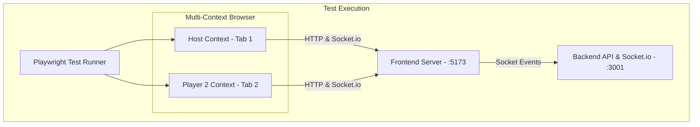
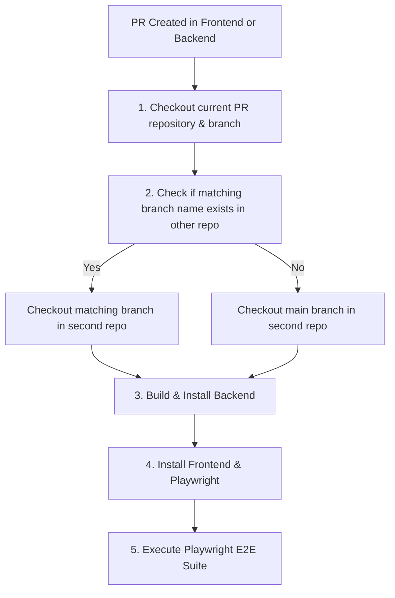

# Inkpostor Testing Strategy & Cross-Repo CI

This document outlines the testing architecture for **Inkpostor**, covering unit testing, multi-client End-to-End (E2E) testing with Playwright, and the cross-repository CI integration strategy between `inkpostor-frontend` and `inkpostor-backend`.

> 💡 **Visual Flow Diagrams**: For step-by-step Mermaid sequence and state machine diagrams for every test spec in the suite, see **[E2E_FLOWS.md](./E2E_FLOWS.md)**.

---

## 1. Multi-Client E2E Architecture

Because Inkpostor is a real-time multiplayer social deduction game, E2E tests must simulate multiple players interacting simultaneously in real-time over WebSockets (Socket.io).

Playwright enables this by instantiating **multiple isolated browser contexts** within a single test execution:



### Multi-Player Test Flow
1. **Host Context**: Opens app, enters name, clicks `Create New Game`, receives generated 6-character room code.
2. **Player 2 Context**: Opens app in a separate browser context, enters player name and room code, clicks `Join Game`.
3. **Synchronization Check**: Validates that both Host and Player 2 see each other live in the lobby room via Socket.io broadcasts.

### E2E Test Suite Roadmap

```mermaid
flowchart TD
    subgraph "100% Complete System E2E Suite (53 Tests)"
        S1[e2e/multiplayer.spec.ts]
        S2[e2e/options-modal.spec.ts]
        S3[e2e/game-modes.spec.ts]
        S4[e2e/canvas-features.spec.ts]
        S5[e2e/full-game-classic.spec.ts]
        S6[e2e/impostor-guess-game.spec.ts]
        S7[e2e/multi-round-hotword.spec.ts]
        S8[e2e/full-game-chaos.spec.ts]
        S9[e2e/reconnection.spec.ts]
        S10[e2e/impostor-inphase-guess.spec.ts]
        S11[e2e/host-actions.spec.ts]
        S12[e2e/canvas-drawing-sync.spec.ts]
        S13[e2e/suspects-marker.spec.ts]
        S14[e2e/validations-errors.spec.ts]
        S15[e2e/i18n-language.spec.ts]
        S16[e2e/real-gameplay-matches.spec.ts]
        S17[e2e/backend-docs-edge-cases.spec.ts]
        S18[e2e/extended-real-gameplay.spec.ts]
        S19[e2e/cross-language-guess.spec.ts]
        S20[e2e/host-drop-recovery.spec.ts]
        S21[e2e/canvas-undo-sync.spec.ts]
        S22[e2e/more-real-gameplay-matches.spec.ts]
        S23[e2e/timer-expirations.spec.ts]
        S24[e2e/room-capacity-limit.spec.ts]
        S25[e2e/non-host-permissions.spec.ts]
        S26[e2e/impostor-lethal-pool.spec.ts]
        S27[e2e/game-mode-staging.spec.ts]
        S28[e2e/original-mode.spec.ts]
        S29[e2e/original-chaos-mode.spec.ts]
        S30[e2e/original-turn-order.spec.ts]
        S31[e2e/original-virtual-voting.spec.ts]
        S32[e2e/sound-options.spec.ts]
    end

    subgraph "Total 100% Production Qualification"
        Qualification["Multiplayer Sync ➔ Modes ➔ Loops ➔ Reconnection ➔ Guesses ➔ Drawing Sync ➔ Suspects ➔ i18n ➔ 15 Real Matches ➔ Limit Guards ➔ Sound & Volume Options ➔ 100% Full System Parity"]
    end

    S1 & S2 & S3 & S4 & S5 & S6 & S7 & S8 & S9 & S10 & S11 & S12 & S13 & S14 & S15 & S16 & S17 & S18 & S19 & S20 & S21 & S22 & S23 & S24 & S25 & S26 & S27 & S28 & S29 & S30 & S31 & S32 --> Qualification
```



---

### E2E Test Suite Specification Directory (56 Tests across 38 Spec Files)

| # | Spec File | Purpose & User Flow Tested | Key Verification & Assertions |
|---|---|---|---|
| 1 | `multiplayer.spec.ts` | Real-time room creation & joining | Host generates room code; Player 2 joins via WebSocket sync |
| 2 | `options-modal.spec.ts` | Game configuration modal rules | Round time, Turn time, Impostor Can Guess toggle, & mode-locking rules |
| 3 | `prevent-repeat-impostors.spec.ts` | Reduce Repeat Inkpostors option | Host opens options, verifies Reduce Repeat toggle defaults to ON, toggles OFF & saves |
| 4 | `game-modes.spec.ts` | Classic vs Chaos mode initialization | Role reveal & initial canvas loading across game modes |
| 5 | `canvas-features.spec.ts` | Emergency Alert & 2-Player Vote-Kick | Emergency Alert forces voting; 2 players kick 3rd player mid-turn |
| 6 | `full-game-classic.spec.ts` | Complete CLASSIC Game Loop Journey | Full journey: Lobby ➔ Roles ➔ Turns ➔ Voting ➔ Ejection ➔ Play Again |
| 7 | `impostor-guess-game.spec.ts` | Impostor Final Guess Feature Flow | Ejected Impostor enters `IMPOSTOR_GUESS` phase ➔ Skip ➔ Crewmates Win |
| 8 | `multi-round-hotword.spec.ts` | Multi-Round `HOT_WORD` Rotation | Tie vote in Round 1 ➔ Next Round ➔ New secret word reveal ➔ Round 2 |
| 9 | `full-game-chaos.spec.ts` | Complete `CUSTOM_WORD` Chaos Journey | Custom word submission ➔ Roles ➔ Drawing ➔ Voting ➔ Victory card |
| 10 | `reconnection.spec.ts` | Network Resilience & Surrender | Disconnect/reconnect mid-game (`setOffline`) & Impostor surrender |
| 11 | `impostor-inphase-guess.spec.ts` | In-Phase Impostor Secret Word Guess | Impostor submits correct secret word mid-turn ➔ Instant Inkpostor Win |
| 12 | `host-actions.spec.ts` | Host End Game & Player Exit | Host manual game termination (`endGame`) & Exit Game room cleanup |
| 13 | `canvas-drawing-sync.spec.ts` | Canvas Mouse Strokes & Undo | Active drawer draws strokes, triggers Undo, verifies canvas across clients |
| 14 | `suspects-marker.spec.ts` | Suspect Marker System | Marking player as suspect during drawing phase persists into voting phase |
| 15 | `validations-errors.spec.ts` | Validation Rules & Minimum Players | Room code validations & disabled START GAME with < 3 players |
| 16 | `i18n-language.spec.ts` | Dynamic i18n Switching | Toggling language between English & Spanish updates UI dynamically |
| 17 | `real-gameplay-matches.spec.ts` | Real Gameplay Matches 1–5 | Unanimous voting, framing innocent, secret word clutch, canvas pixel data |
| 18 | `backend-docs-edge-cases.spec.ts` | Backend `game_states.md` Edge Cases | Host kick, last voter disconnect resolution, last result player disconnect |
| 19 | `extended-real-gameplay.spec.ts` | Real Gameplay Matches 6–10 | Multi-round tie, 4-player vote-kick (3/3), ink depletion, rapid 3-round |
| 20 | `cross-language-guess.spec.ts` | Localized Secret Word Validation | Spanish Impostor vs English Host secret word translation validation |
| 21 | `host-drop-recovery.spec.ts` | Mid-Turn Host Tab Closure | Host closes tab mid-turn ➔ turn advances to Player 2 without UI freeze |
| 22 | `canvas-undo-sync.spec.ts` | Canvas Undo Stack Pixel Matching | 3 strokes, 2 undos, clear canvas ➔ `canvas.toDataURL()` pixel match |
| 23 | `more-real-gameplay-matches.spec.ts` | Real Gameplay Matches 11–15 | 5-player split vote tie, emergency alert disconnect, palette/eraser sync |
| 24 | `timer-expirations.spec.ts` | Turn & Voting Timer Expirations | Turn timer auto-advances turn; voting timer auto-skips unsubmitted votes |
| 25 | `room-capacity-limit.spec.ts` | 10-Player Capacity Limit Guard | 10 players fill lobby; 11th player join attempt handled gracefully |
| 26 | `non-host-permissions.spec.ts` | Non-Host UI Permission Guards | Non-host player omits START GAME button & options locked in read-only |
| 27 | `impostor-lethal-pool.spec.ts` | Impostor Loses On The Last Attempt | Host makes the guess pool lethal; a wrong guess empties it and ends the game with the Inkpostor defeated |
| 28 | `game-mode-staging.spec.ts` | Game Mode Staging In The Options Modal | Mode staged until save & discarded on close; a mode that hides the drawing options gives them back on the way out |
| 29 | `original-mode.spec.ts` | `ORIGINAL` Spoken Round Loop | Full round loop without ever reaching a canvas; `hideHint` keeps the category from the Inkpostor |
| 30 | `original-chaos-mode.spec.ts` | `ORIGINAL_CHAOS` Player-Written Word | Word selection first, then the spoken round with no canvas |
| 31 | `original-turn-order.spec.ts` | `ORIGINAL` Turn Order Options | `FIXED_ORDER` keeps the announced order between rounds; `RANDOM_ORDER` redraws it with every player still in it |
| 32 | `multi-impostor.spec.ts` | Multi-Impostor CLASSIC Full Game Journey | Configure 2 Inkpostors in 5-player lobby ➔ Teammate role reveal ➔ Round 1 Inkpostor ejection (1 remaining) ➔ Round 2 final Inkpostor ejection & victory |
| 33 | `multi-impostor-hotword.spec.ts` | Multi-Impostor `HOT_WORD` Game Journey | 5-player `HOT_WORD` mode with 2 Inkpostors ➔ Round 1 ejection ➔ Word Reveal phase for new secret word ➔ Round 2 final ejection |
| 34 | `multi-impostor-customword.spec.ts` | Multi-Impostor `CUSTOM_WORD` Chaos Journey | 5-player Chaos mode ➔ Word Selection excludes words from BOTH Inkpostors ➔ Round 1 ejection ➔ Round 2 victory |
| 35 | `multi-impostor-original.spec.ts` | Multi-Impostor `ORIGINAL` Spoken Journey | 5-player Spoken mode ➔ Teammate role reveal ➔ ORDER_INFO phase ➔ Round 1 ejection ➔ ORDER_INFO Round 2 ➔ Round 2 victory |
| 36 | `impostor-count-shrinks.spec.ts` | Inkpostor Count Follows The Room | 2 Inkpostors saved in a 5-player lobby ➔ one player leaves ➔ count comes back down to 1 for the host and for a guest reading the modal, with both steppers disabled |
| 37 | `original-virtual-voting.spec.ts` | Spoken Modes Without The Virtual Voting | The default: no confirmation gate and no voting screen ➔ only the host gets Reveal Results ➔ RESULTS lists the Inkpostors with the secret word and Play Again, in `ORIGINAL` and in `ORIGINAL_CHAOS` |
| 38 | `sound-options.spec.ts` | Sound & Volume Controls | Topbar mute toggle, Options modal volume slider adjustment, test sound button, and localStorage persistence |

> 🎨 **Multi-Client Game Flow Diagrams**: Detailed phase-by-phase state machine diagrams for Multi-Impostor games, Classic mode, Spoken modes, and all 38 E2E test files are available in **[docs/E2E_FLOWS.md](./E2E_FLOWS.md)**.

---

## 2. Cross-Repository CI Strategy (Strategy 1)

`inkpostor-frontend` and `inkpostor-backend` live in separate repositories. To ensure changes in one repo do not break the other, GitHub Actions uses a **Dynamic Dual-Checkout Strategy**.



### Key Rules for Cross-Repo PRs:
* **Single-Repo Changes**: If a PR is frontend-only or backend-only, CI automatically runs E2E tests against `main` of the other repository.
* **Synchronized Multi-Repo Changes**: If a feature requires changes in both repositories, **name the branches identically** (e.g. `feat/new-game-mode` in both repos). The CI pipeline will automatically pair the matching branches and test them together.

---

## 3. Running Tests Locally

### End-to-End (E2E) Tests (Playwright)

From the `inkpostor-frontend` directory:

```bash
# Run E2E tests headlessly (auto-starts backend & frontend dev servers)
pnpm test:e2e

# Run E2E tests in Playwright Interactive UI Mode
pnpm test:e2e:ui
```

> **Note:** Playwright's `webServer` configuration automatically boots up `inkpostor-backend` (`:3001`) and `inkpostor-frontend` (`:5173`) before test execution begins.

### Unit & Component Tests (Vitest)

* **Frontend Unit Tests:**
  ```bash
  cd inkpostor-frontend
  pnpm test
  ```

* **Backend Unit Tests:**
  ```bash
  cd inkpostor-backend
  pnpm test
  ```
